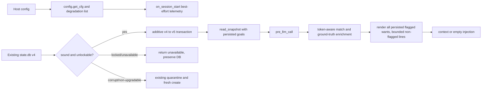

# Phase 8: Close Known Gaps - Research

**Researched:** 2026-09-10\
**Domain:** Python/SQLite drive-layer reconciliation and verification on `main`\
**Confidence:** HIGH

<user_constraints>
## User Constraints (from CONTEXT.md)

### Locked Decisions
## Binding constraints
- Constitution Principles I-VII remain binding; classifier status grants no permission to amend them.
- Preserve the complete acceptance contract in `.planning/intel/requirements.md`, including user stories, edge cases, assumptions and SC IDs.
- Apply `.planning/INGEST-CONFLICTS.md`: flagged priorities cannot be withheld by a cap; interruption exceptions are not approved under the current constitution.
- Dependencies: Phase 7. Phase numbers alone add no dependencies.
- State: Pending; no implementation or completion implied.

### the agent's Discretion
No separate discretion section was captured in `08-CONTEXT.md`.

### Deferred Ideas (OUT OF SCOPE)
No feature implementation, provider access, Hermes installation, commit or publication is authorized merely by this intake. Excluded source inputs remain listed in `.planning/GSD-MIGRATION.md`.
</user_constraints>

## Project Constraints (from AGENTS.md)

- Use the active GSD planning records; the preserved `.planning/reference/` documents are intake evidence, not an alternate execution queue. [VERIFIED: AGENTS.md:58-73]
- Keep Constitution Principles I-VII, zero new dependencies, `$HERMES_HOME`/config-derived paths, `kind: standalone`, `**kwargs` hooks, and the `__init__.py` manifest-string prohibition intact. [VERIFIED: AGENTS.md:91-109]
- Keep every hook fail-open and observational: no directives, tool execution, memory-provider writes, or turn gating. [VERIFIED: AGENTS.md:96-101]
- Use `./scripts/test.sh` as the repository test gate; live-provider evidence is separate. [VERIFIED: AGENTS.md:105-109]
- Make a minimal surgical change, preserve existing tests, do not add dependencies, do not commit without explicit authorization, and leave unrelated work untouched. [VERIFIED: AGENTS.md:23-51]

## Summary

Phase 8 should implement only the Gap-001 behavior that is missing from the integration baseline `eb228d788fc474128d2c74514ffe44ab1052a253`. The baseline canonical suite passed `165` tests in `9.36s` in this worktree. This establishes an offline unit/integration baseline only; no provider, Hermes installation, or live smoke was run. [VERIFIED: `./scripts/test.sh` output, 2026-09-10]

The unmerged `001-close-known-gaps` tip `af2a0bc3a45ceef3d37c15bba567e8f865879edc` is seven commits beyond merge-base `caed64b2cab5d7a649630d831b3a6a9caac3750b`; four runtime/test commits modify thirteen `anansi/` files by 763 additions and 55 deletions. Its additive v4-to-v5 migration, config-degradation telemetry design, whole-token goal matching, and `stalled_days == 0` treatment are useful starting points. Its flagged-want cap is prohibited by Constitution III and the GSD conflict resolution, and its migration/ground-truth handling needs correction before reuse. [VERIFIED: `git log`, `git diff --stat eb228d7..af2a0bc`, .planning/INGEST-CONFLICTS.md:13-19]

**Primary recommendation:** Re-implement selected runtime changes directly on `main`, beginning with tests: a lock-safe, additive goal migration; configuration telemetry; pressure rendering; token-aware association; and fresh-day rendering. Do not merge or cherry-pick the development branch wholesale, and never cap, count, or withhold persisted flagged priorities.

## Architectural Responsibility Map

| Capability | Primary Tier | Secondary Tier | Rationale |
|---|---|---|---|
| Per-goal pressure persistence and migration | Database / Storage | API / Backend | `store.py` is the sole SQLite surface and owns schema, transaction, and snapshot behavior. [VERIFIED: .planning/reference/CONSTITUTION.md:45-52] |
| Config coercion and degradation telemetry | API / Backend | Database / Storage | Config is defensively read in process; telemetry is best-effort state observation. [VERIFIED: anansi/config.py:188-198; anansi/store.py:900-948] |
| Drive pressure, goal matching, fresh/stalled rendering | API / Backend | Database / Storage | Rendering consumes persisted goals and read-time momentum, then returns a context block. [VERIFIED: anansi/__init__.py:194-269; anansi/render.py:171-226] |
| Live Criterion-1 evidence | Host/runtime boundary | API / Backend | The smoke script reaches the host facade but is an environment-gated verification lane. [VERIFIED: scripts/live_drive_smoke.py:1-24; scripts/live_drive_smoke.py:51-137] |

<phase_requirements>
## Phase Requirements

| ID | Description | Research Support |
|---|---|---|
| REQ-001-close-known-gaps-fr-001 | Persist per-goal pressure metadata through the single SQLite store so it round-trips a read/write cycle. | Additive v4-to-v5 migration and store round-trip tests. |
| REQ-001-close-known-gaps-fr-002 | Migrate an existing goals table without data loss and without raising; goals lacking new fields read documented defaults. | Lock-safe migration state machine and legacy-default tests. |
| REQ-001-close-known-gaps-fr-003 | Read global drive_pressure and apply it to drive rendering, with invalid values coerced to the documented default. | Config-to-render wiring and identical-input output tests. |
| REQ-001-close-known-gaps-fr-004 | Emit a legible telemetry row whenever a config value is coerced away from the user-supplied value. | Per-key configuration-degradation detection and best-effort row tests. |
| REQ-001-close-known-gaps-fr-005 | Redact secret-like config values in degradation telemetry and never raise or block the turn if telemetry storage is unavailable. | Shape-only redaction and locked-telemetry full-hook tests. |
| REQ-001-close-known-gaps-fr-006 | Bound rendered flagged wants with a proportionate cap while guaranteeing the highest-priority flagged wants render and visibly indicating withheld wants. | Reconciled by Constitution III: do not implement a cap or withholding; retain bounded non-flagged energy/token behavior only. |
| REQ-001-close-known-gaps-fr-007 | Keep the never-omit invariant under the cap, verified against persisted state rather than model output. | Persisted-goal, model-omission, token-crowding, and all-flagged tests, with no cap. |
| REQ-001-close-known-gaps-fr-008 | Avoid false-positive goal-to-signal associations caused by loose substring matching while preserving legitimate associations. | Whole-token subset matcher plus false-positive/true-positive tests. |
| REQ-001-close-known-gaps-fr-009 | Handle stalled_days=0 with a well-formed fresh/active read distinct from stalled rendering and an empty line. | Explicit zero-day note, want, ordering, and model-override tests. |
| REQ-001-close-known-gaps-fr-010 | Provide a documented single-command live-smoke lane for first-person owned-want voice and report an honest environment-gated outcome when no provider is reachable. | Existing live script and documented exit-code behavior; record an honest unrun/inconclusive result if provider access remains unavailable. |
| REQ-001-close-known-gaps-fr-011 | Rename master kill switch terminology in tests/comments to primary/main with no runtime behavior change. | Test/comment-only rename plus grep and full-suite check. |
| REQ-001-close-known-gaps-fr-012 | Hold all constitution principles; keep full fail-open matrix and never-omit tests green without weakening a principle. | Constitution check, targeted failure paths, existing matrix, and canonical suite. |
</phase_requirements>

## Acceptance Contract Traceability

| Source user story and acceptance scenarios | Implementation/validation obligation |
|---|---|
| **US-1, scenarios 1-3:** pressure values survive a fresh snapshot, influence stalled rendering, and a locked/corrupt read degrades silently. | Add/round-trip the three pressure fields; test v4 upgrade, legacy defaults, persisted firm behavior, and full-hook fail-open. [VERIFIED: .planning/intel/requirements.md:296-318] |
| **US-2, scenarios 1-2:** quiet differs from standard/firm and malformed global pressure defaults without a raise. | Wire effective `drive_pressure` through `pre_llm_call` to rendering; verify each valid level on identical input and invalid coercion. [VERIFIED: .planning/intel/requirements.md:322-339] |
| **US-3, scenarios 1-3:** each malformed known key produces a legible row; secret-like inputs are redacted; valid config produces no event. | Compute rejected-key events after coercion, record one shape-only `config_degraded` row per key, and preserve normal rendering if telemetry is unavailable. [VERIFIED: .planning/intel/requirements.md:343-362] |
| **US-4, scenarios 1-3:** source cap/withheld-marker behavior. | Reconcile source intent to the higher constitutional rule: render every persisted flagged priority, with no cap and no withheld marker. Verify the protected prefix under crowding. [VERIFIED: .planning/intel/requirements.md:366-387; .planning/INGEST-CONFLICTS.md:13-19] |
| **US-5, scenarios 1-2:** reject substring-only matches and retain legitimate associations. | Use whole-token subset matching and test both cases. [VERIFIED: .planning/intel/requirements.md:391-407] |
| **US-6, scenario 1:** a zero-day goal has a nonempty fresh/active read. | Use `stalled_days > 0` for stalled language and test note, want, and sort order. [VERIFIED: .planning/intel/requirements.md:411-424] |
| **US-7, scenarios 1-2:** provider-backed first-person want evidence or honest environment-gated result. | Preserve the existing single command and report only its actual exit/result after separately authorized execution. [VERIFIED: .planning/intel/requirements.md:428-446; scripts/live_drive_smoke.py:18-24] |
| **US-8, scenario 1:** terminology changes without behavioral assertion changes. | Rename the test/comment identifier, grep the scoped test/comment surface, and rerun the suite. [VERIFIED: .planning/intel/requirements.md:450-464] |

### Required edge-case trace

| Edge case | Required test/result |
|---|---|
| Pre-existing `goals` table has no pressure columns | In-place additive upgrade preserves its rows and reads pressure defaults. [VERIFIED: .planning/intel/requirements.md:468-472] |
| Locked/corrupt DB on a new surface | Lock is unavailable/fail-open and non-destructive; corruption follows the established recovery contract. [VERIFIED: .planning/intel/requirements.md:473-475] |
| Telemetry store is locked | Config-degradation recording does not raise or block. [VERIFIED: .planning/intel/requirements.md:474-475] |
| Historical cap is zero or negative | No cap is implemented for flagged priorities under settled precedence, so all persisted flagged goals still render. [VERIFIED: .planning/intel/requirements.md:476-477; .planning/INGEST-CONFLICTS.md:13-19] |
| Every goal has `stalled_days=0` | Each line is fresh/active and contains no stalled/under-support language. [VERIFIED: .planning/intel/requirements.md:478-479] |

### Success-Criteria trace

| SC ID | Phase gate |
|---|---|
| SC-001 | Each of G1-G8 is either closed with current evidence or, for provider-dependent G1, left with the existing ready-to-run command and honest result. [VERIFIED: .planning/intel/requirements.md:527-528] |
| SC-002 | Pressure read-back checks and a pre-existing-v4 migration prove no goal data loss. [VERIFIED: .planning/intel/requirements.md:529-530] |
| SC-003 | Identical inputs show distinct valid pressure outputs; invalid inputs do not raise. [VERIFIED: .planning/intel/requirements.md:531-532] |
| SC-004 | One legible secret-safe row per degradation and none for valid config. [VERIFIED: .planning/intel/requirements.md:533-534] |
| SC-005 | Every persisted flagged priority remains present under adversarial crowding. The source's numeric cap is superseded. [VERIFIED: .planning/intel/requirements.md:535-537; .planning/INGEST-CONFLICTS.md:13-19] |
| SC-006 | Canonical suite is green without weakened assertions. [VERIFIED: .planning/intel/requirements.md:538-539] |

## Standard Stack

### Core

| Library | Version | Purpose | Why Standard |
|---|---:|---|---|
| Python standard-library `sqlite3` | Python 3.11.15 runtime observed | Single SQLite state surface and additive migration | Constitution V requires zero new dependencies and Constitution IV requires the single `store.py` surface. [VERIFIED: .planning/reference/CONSTITUTION.md:45-58; environment probe, 2026-09-10] |
| Existing `pytest` staged/runtime availability | 9.1.1 observed | Offline unit and hook-path verification | The canonical shell gate executes the test suite with the Hermes venv and repo-local `PYTHONPATH`. [VERIFIED: scripts/test.sh:1-31; environment probe, 2026-09-10] |

### Supporting

| Library | Version | Purpose | When to Use |
|---|---:|---|---|
| Existing host `ctx.llm` / `PluginLlm` | host-managed | Existing appraisal and opt-in live-smoke boundary | Use only through existing paths; do not call providers during Phase 8 implementation. [VERIFIED: AGENTS.md:91-109; scripts/live_drive_smoke.py:59-100] |

**Installation:** None. This phase installs no package and must not modify the Hermes venv. [VERIFIED: .planning/reference/CONSTITUTION.md:53-58; scripts/test.sh:14-27]

## Branch Reconciliation

**Entire runtime/test candidate diff:** `anansi/__init__.py`, `anansi/config.py`, `anansi/render.py`, `anansi/store.py`, `anansi/tests/test_drive_config.py`, `anansi/tests/test_drive_neveromit.py`, `anansi/tests/test_drive_store.py`, `anansi/tests/test_drive_velocity.py`, `anansi/tests/test_failopen_matrix.py`, `anansi/tests/test_reflection.py`, `anansi/tests/test_reflection_store.py`, and `anansi/tests/test_telemetry_store.py`; the candidate also edits `anansi/README.md`. No `scripts/` runtime file differs. [VERIFIED: `git diff --name-status eb228d7..af2a0bc -- anansi scripts`]

| Development commit | Scope | Disposition for Phase 8 | Reason |
|---|---|---|---|
| `531f390` | Default appraisal-model change | Defer | It is not an identified G1-G8 requirement. [VERIFIED: `git show -s 531f390`; .planning/REQUIREMENTS.md:177-199] |
| `61b28a5` | legacy planning/process files | Do not ingest | GSD is the active workflow and the branch predates the current intake. [VERIFIED: AGENTS.md:58-73; `git log --left-right eb228d7...af2a0bc`] |
| `cb986a2` | Schema v5 pressure fields and additive migration | Reuse with correction | Reuse its additive-column direction; prevent locked v4 DBs from entering quarantine. [VERIFIED: `001-close-known-gaps:anansi/store.py`:245-315] |
| `4bfbee6` | Test/comment terminology rename | Reuse | It is source-only wording and the baseline still contains `test_master_kill_switch_disables_reflection`. [VERIFIED: anansi/tests/test_reflection.py:513-533; `git show 4bfbee6`] |
| `8da86e8` | Pressure wiring, telemetry, matching, zero-day handling, cap | Selectively reuse | Keep pressure, telemetry, word-token matcher, and `> 0` fresh handling; reject the flagged cap and correct model-value precedence. [VERIFIED: `001-close-known-gaps:anansi/config.py`:201-350; `001-close-known-gaps:anansi/render.py`:184-202,270-356,370-431] |
| `5976df3` | README/config documentation | Re-author only after final behavior | It documents a cap forbidden by current precedence; do not copy it. [VERIFIED: `git show 5976df3`; .planning/INGEST-CONFLICTS.md:13-19] |
| `af2a0bc` | Backlog specifications | Already ingested as evidence | The acceptance contract is preserved in `.planning/intel/requirements.md`; source docs do not prove main behavior. [VERIFIED: .planning/intel/SYNTHESIS.md:18-23,44-47] |

### Reconciliation findings that must change before adoption

1. **Locked migration must preserve the database.** The branch's `_try_upgrade()` returns `False` on an SQLite exception, then `ensure_db()` invokes `_quarantine(path)`. A transient `locked` failure therefore follows the same path as structural corruption and can remove a valid v4 database from service. The Phase 8 target must classify transient open/lock failure as the dedicated unavailable result (`None` from Plan 08-01's tri-state upgrade helper), leave the database and sidecars untouched, and make `ensure_db` return its ordinary fail-open unavailable value without recovery. Structural invalidity remains the only upgrade-helper result that reaches the existing quarantine path. [VERIFIED: `001-close-known-gaps:anansi/store.py`:245-315; `.planning/phases/08-close-known-gaps/08-01-PLAN.md`]

2. **Persisted momentum must override model metadata.** The branch only assigns the persisted `stalled_days` when that key is absent from a model signal: `if isinstance(days, int) and "stalled_days" not in sig:`. A model value can therefore survive over the read-time value. The implementation must replace a matching signal's model-supplied value with the persisted neutral momentum value, including `0`, and remove/ignore it when persisted momentum has no day count. [VERIFIED: anansi/render.py:171-226; `001-close-known-gaps:anansi/render.py`:205-260]

3. **No flagged-priority cap is permissible.** The development branch deliberately truncates `flagged = flagged[:cap]` and emits a withheld marker. Constitution III says user-flagged priorities are exempt from top-N slicing, token-cap line-drop, and energy budget. The intake resolution says that constitutional rule wins. Preserve all persisted flagged priorities, accepting an over-soft-token-target block if necessary, as the current renderer already does. [VERIFIED: .planning/reference/CONSTITUTION.md:36-52; .planning/INGEST-CONFLICTS.md:13-19; `001-close-known-gaps:anansi/render.py`:370-431; anansi/render.py:516-528]

## Architecture Patterns



### Pattern 1: Classify migration failure before recovery

**What:** Verify a v4 database first, apply only additive `ALTER TABLE` changes in one transaction, update schema version only after those changes succeed, and distinguish a sound-but-locked database from corruption.

**When to use:** Only on the `goals` v4-to-v5 transition required by FR-001/002.

**Required invariants:** The source-of-truth v4 goal fields are `"id INTEGER PRIMARY KEY, text TEXT NOT NULL"` through `"domain TEXT, created_at TEXT, updated_at TEXT"`; Phase 8 adds exactly `"support_style TEXT"`, `"push_when_stalled INTEGER NOT NULL DEFAULT 0"`, and `"stall_threshold_days INTEGER"`. [VERIFIED: anansi/store.py:90-112; `001-close-known-gaps:anansi/store.py`:115-121]

### Pattern 2: Persisted state wins over generated data

**What:** Match a model goal signal to a persisted goal using whole tokens, then copy user-authorized pressure metadata and read-time momentum from that goal into the render input.

**When to use:** For any goal signal that matches an active persisted goal. The matcher should retain token-subset matches such as `drive layer` and `ship the drive layer`, and reject substring-only matches. [VERIFIED: `001-close-known-gaps:anansi/render.py`:184-202]

### Pattern 3: Bounded non-flagged output with protected persisted priorities

**What:** Keep the existing energy-budget and token-cap behavior for non-flagged notes. Put every flagged persisted want in the protected prefix, outside both caps.

**When to use:** Every successful drive render. The current baseline suppresses a successful empty signal mapping, but the Phase 8 target in Plan 08-03 renders persisted active flagged wants even when `signals={}`. Actual appraisal failure remains distinct as `signals is None` and still produces an empty injection. [VERIFIED: anansi/render.py:365-385; anansi/render.py:516-528; `.planning/phases/08-close-known-gaps/08-03-PLAN.md`]

### Anti-patterns to avoid

- **Wholesale branch merge:** It reverses/duplicates the GSD migration and brings a stale workflow surface into a main-based phase. [VERIFIED: `git diff --name-status eb228d7..af2a0bc`]
- **Treating a lock as corruption:** It risks a data-erasing quarantine on an available-but-busy v4 DB. [VERIFIED: `001-close-known-gaps:anansi/store.py`:245-315]
- **Capping flagged wants:** It violates the settled constitutional precedence even when the omission marker is visible. [VERIFIED: .planning/INGEST-CONFLICTS.md:13-19]
- **Trusting model `stalled_days`:** It violates ground-truth-at-read-time when it disagrees with persisted momentum. [VERIFIED: .planning/reference/CONSTITUTION.md:45-52; anansi/render.py:171-226]

## Don't Hand-Roll

| Problem | Don't Build | Use Instead | Why |
|---|---|---|---|
| New persistence service or migration framework | Separate DB, ORM, or dependency | Existing `store.py` SQLite transaction surface | Constitution IV/V require one SQLite surface and zero dependencies. [VERIFIED: .planning/reference/CONSTITUTION.md:45-58] |
| New live-provider harness | A second smoke path or direct provider client | `scripts/live_drive_smoke.py` | It already defines honest PASS/FAIL/INCONCLUSIVE exit behavior without touching live state. [VERIFIED: scripts/live_drive_smoke.py:1-24,51-137] |
| Custom text-matching dependency | Fuzzy/semantic matcher | Existing stdlib regex whole-token subset helper | The branch helper is enough for the stated substring false-positive requirement and keeps the zero-dependency constraint. [VERIFIED: `001-close-known-gaps:anansi/render.py`:184-202] |

## Runtime State Inventory

| Category | Items Found | Action Required |
|---|---|---|
| Stored data | Existing plugin `state.db` can hold schema-v4 `goals` rows without pressure columns. The repository source, not a live database, was inspected. [VERIFIED: anansi/store.py:90-112] | Additive data migration with a preservation-under-lock regression test. |
| Live service config | Host `plugins.entries.anansi` supplies the config entry; no live host config was inspected. [VERIFIED: anansi/config.py:74-101] | Code edit only: read/coerce configuration and record secret-safe degradation observations. |
| OS-registered state | No OS registration is in Phase 8 source scope; no host/system scan was authorized. [ASSUMED] | None planned. |
| Secrets/env vars | `$HERMES_HOME` locates state; configuration values can be secret-like and must not be copied into telemetry. No actual secret was read. [VERIFIED: anansi/store.py:124-136; `001-close-known-gaps:anansi/config.py`:201-219] | Code edit only: record type/length shape, never literal input. |
| Build artifacts / installed packages | No package installation or built artifact is required; the canonical test script uses the existing Hermes venv. [VERIFIED: scripts/test.sh:14-31] | None planned. |

## Common Pitfalls

### Pitfall 1: Solving the historical cap instead of the settled requirement
**What goes wrong:** Lower-priority persisted flagged goals disappear from the surface.\
**How to avoid:** Keep every flagged goal in the protected prefix and test model omission plus token crowding. [VERIFIED: .planning/INGEST-CONFLICTS.md:13-19; anansi/tests/test_drive_neveromit.py:129-283]

### Pitfall 2: Losing a valid database during a transient lock
**What goes wrong:** A migration failure reaches the existing quarantine path.\
**How to avoid:** Add a real v4 DB, hold a writer/reader-blocking lock, call `ensure_db`, and assert no rename, removal, schema change, or data loss. [VERIFIED: `001-close-known-gaps:anansi/store.py`:245-315]

### Pitfall 3: Reintroducing stale generated time data
**What goes wrong:** A model-produced `stalled_days` wins over persisted read-time momentum, or zero renders as stalled.\
**How to avoid:** Overwrite matched signal timing from persisted state and test both a conflicting positive value and `0`. [VERIFIED: anansi/render.py:171-226,278-322; `001-close-known-gaps:anansi/render.py`:270-356]

### Pitfall 4: Telemetry becomes a new failure path or secret leak
**What goes wrong:** Rejected config is logged literally, or a locked telemetry store raises through a hook.\
**How to avoid:** Emit a shape-only message in a narrow `try/except`; test exactly one row for each rejected key, none for valid input, and normal hook output with telemetry unavailable. [VERIFIED: `001-close-known-gaps:anansi/config.py`:201-270; `001-close-known-gaps:anansi/__init__.py`:138-151]

## Code Examples

### Additive migration decision skeleton

```python
# Preserve a sound-but-locked v4 database: do not quarantine it.
if is_v4_and_sound(path):
    if not acquire_upgrade_transaction(path):
        return False
    add_columns(
        "support_style TEXT",
        "push_when_stalled INTEGER NOT NULL DEFAULT 0",
        "stall_threshold_days INTEGER",
    )
    set_schema_version(5)
```

The quoted columns and version are the proposed branch's additive v5 schema values: `"support_style TEXT"`, `"push_when_stalled INTEGER NOT NULL DEFAULT 0"`, `"stall_threshold_days INTEGER"`, and `"SCHEMA_VERSION = 5"`. The final implementation must use existing repository helpers and style, not this pseudo-code. [VERIFIED: `001-close-known-gaps:anansi/store.py`:35,115-121]

### Ground-truth enrichment rule

```python
# After a whole-token match, persisted read-time momentum replaces model timing.
signal["momentum"] = persisted_goal["momentum"]["momentum"]
signal["stalled_days"] = persisted_goal["momentum"]["stalled_days"]
```

The current renderer already assigns `sig["momentum"] = momentum.get("momentum")`; the branch’s conditional protection of a model value is the defect to remove. [VERIFIED: anansi/render.py:200-209; `001-close-known-gaps:anansi/render.py`:238-243]

## State of the Art

| Historical source approach | Current Phase 8 approach | Impact |
|---|---|---|
| Quarantine on every schema mismatch | One narrowly-scoped additive v4-to-v5 migration, preserving lock-unavailable DBs | Protects user-minted goals while retaining fail-open degradation. [VERIFIED: anansi/store.py:186-315; `001-close-known-gaps:anansi/store.py`:245-315] |
| Flagged-priority cap plus marker | All persisted flagged priorities protected; non-flagged content remains bounded | Applies constitution-over-cap precedence. [VERIFIED: .planning/INGEST-CONFLICTS.md:13-19; anansi/render.py:516-528] |
| Loose substring association | Whole-token subset association | Prevents `auth`/`author`-class false positives without a dependency. [VERIFIED: anansi/render.py:192-202; `001-close-known-gaps:anansi/render.py`:184-202] |

## Assumptions Log

| # | Claim | Section | Risk if Wrong |
|---|---|---|---|
| A1 | No OS-registered Phase 8 state requires migration. | Runtime State Inventory | A host-specific registration could retain obsolete terminology or state. |

## Resolved Dispositions

1. **RESOLVED: classify a locked but structurally sound v4 database as unavailable.**
   - Selected disposition: Plan 08-01 uses `None` from `_try_upgrade_v4_to_v5(path)` for transient open/lock unavailability, preserves the database and sidecars without partial migration or quarantine, and lets `ensure_db` return its existing fail-open unavailable value. Only structural invalidity or unsupported versions return the helper's recovery result. [VERIFIED: `001-close-known-gaps:anansi/store.py`:245-315; `.planning/phases/08-close-known-gaps/08-01-PLAN.md`]

2. **RESOLVED: live Criterion-1 provider proof remains UNRUN pending separate authorization.**
   - Selected disposition: retain the existing command and exit contract. Do not infer `PASS` or `INCONCLUSIVE` without execution. After separate authorization, record `PASS` only from exit `0`, `FAIL` from exit `1`, and `INCONCLUSIVE` from exit `2` with the actual provider-gate evidence. [VERIFIED: scripts/live_drive_smoke.py:18-24; `.planning/phases/08-close-known-gaps/08-04-PLAN.md`]

## Environment Availability

| Dependency | Required By | Available | Version | Fallback |
|---|---|---:|---|---|
| Hermes venv Python | canonical test gate | yes | Python 3.11.15 | none |
| pytest import through test environment | canonical test gate | yes | 9.1.1 | none |
| Git | branch reconciliation | yes | 2.55.0 | none |
| Reachable model provider | live Criterion-1 proof | intentionally not probed | — | keep proof UNRUN pending separate authorization; if authorized execution returns provider-gated exit 2, record INCONCLUSIVE |

**Missing dependencies with no fallback:** None for implementation and offline validation.\
**Missing dependencies with fallback:** Live provider proof remains UNRUN and environment-gated pending separate authorization; `scripts/live_drive_smoke.py` supplies the honest exit status only when actually executed. [VERIFIED: scripts/live_drive_smoke.py:18-24]

## Validation Architecture

### Test Framework

| Property | Value |
|---|---|
| Framework | Existing pytest, observed 9.1.1 |
| Config file | none; `scripts/test.sh` sets the interpreter and test path |
| Quick run command | `./scripts/test.sh anansi/tests/test_drive_store.py anansi/tests/test_drive_config.py anansi/tests/test_drive_velocity.py anansi/tests/test_drive_neveromit.py anansi/tests/test_failopen_matrix.py anansi/tests/test_reflection.py` |
| Full suite command | `./scripts/test.sh` |

### Phase Requirements to Test Map

| Requirement / SC | Behavior | Test type and concrete command | Existing selector / Wave 0 work |
|---|---|---|---|
| FR-001, FR-002, SC-002 | v4 pressure columns migrate in place, preserve rows/defaults, never quarantine a locked sound v4 DB | unit: `./scripts/test.sh anansi/tests/test_drive_store.py` | Extend `test_drive_store.py` with v4 migration, legacy defaults, and locked-v4 preservation. |
| FR-003, SC-003 | quiet/standard/firm render distinguishably and invalid values default | unit: `./scripts/test.sh anansi/tests/test_drive_config.py` | Reuse branch test concept `test_pressure_levels_are_distinguishable`; add main-path config-to-render integration assertion. |
| FR-004, FR-005, SC-004 | one secret-safe degradation event per rejected key; telemetry failure cannot block | unit + hook: `./scripts/test.sh anansi/tests/test_drive_config.py anansi/tests/test_failopen_matrix.py` | Add configuration telemetry tests and unavailable-telemetry full-hook test. |
| FR-006, FR-007, SC-005 | all persisted flagged priorities survive model omission, crowding, token cap, and any proposed cap input | unit + hook: `./scripts/test.sh anansi/tests/test_drive_neveromit.py` | Preserve existing `test_multiple_flagged_goals_all_survive_slice`, `test_flagged_goal_survives_token_cap`, and `test_neveromit_full_hook`; add regression that any retired cap config has no withholding effect. |
| FR-008 | false substring links drop; token-subset true links survive | unit: `./scripts/test.sh anansi/tests/test_drive_velocity.py` | Add branch concepts `test_matching_drops_substring_false_positives` and `test_matching_keeps_whole_word_associations`. |
| FR-009 | `stalled_days=0` is fresh/active in note, want, ordering, and persisted override path | unit: `./scripts/test.sh anansi/tests/test_drive_velocity.py` | Add branch zero-day tests plus a conflicting model `stalled_days` regression. |
| FR-010, SC-001 | live first-person owned-want proof or honest environment gate | manual environment-gated: `$HERMES_HOME/hermes-agent/venv/bin/python scripts/live_drive_smoke.py` | Existing `scripts/live_drive_smoke.py`; not run in this task. Record output verbatim only after separately authorized execution. |
| FR-011 | test/comment terminology only | static + full: `git grep -n -i -e 'master kill switch' -e 'master.*kill' -e 'kill.*master' HEAD -- anansi`; `./scripts/test.sh` | Rename current `test_master_kill_switch_disables_reflection` only; no runtime source edits for this item. |
| FR-012, SC-006 | constitutional invariants, full fail-open matrix, never-omit tests remain green | full: `./scripts/test.sh` | Existing `test_failopen_matrix.py`, `test_drive_neveromit.py`, and `test_anticreep.py` stay unweakened. |

### Test risks and evidence limits

- The current test gate passed `165` tests in `9.36s`; this does not validate proposed Phase 8 behavior until the new tests and implementation exist. [VERIFIED: `./scripts/test.sh` output, 2026-09-10]
- Historical branch test counts and its claimed completion are historical evidence only, because this task did not switch or mutate the user-owned original checkout. [VERIFIED: `08-CONTEXT.md`:19-23]
- The live smoke is intentionally unrun. It proves host/provider behavior only when separately authorized and successful; it must never be represented as fresh evidence from an offline suite. [VERIFIED: scripts/live_drive_smoke.py:1-24]

### Sampling Rate

- **Per implementation task:** the focused test command for its requirement row.
- **Per plan wave:** the quick multi-file command above.
- **Phase gate:** `./scripts/test.sh` green, unchanged constitutional tests, plus an honest live-smoke outcome.

### Wave 0 Gaps

- [ ] `anansi/tests/test_drive_store.py` — v4 locked-migration preservation and legacy-pressure defaults.
- [ ] `anansi/tests/test_drive_config.py` and `anansi/tests/test_failopen_matrix.py` — per-key config-degradation telemetry, secret redaction, and unavailable telemetry storage.
- [ ] `anansi/tests/test_drive_velocity.py` — token matching, zero-day freshness, and persisted-over-model `stalled_days` precedence.
- [ ] `anansi/tests/test_drive_neveromit.py` — constitution-precedence regression that all persisted flagged priorities render without a withholding marker.

## Security Domain

`security_enforcement` is explicitly `false` in `.planning/config.json`; a separate ASVS register is not required for this phase. The implementation still must preserve existing input sanitization, secret-safe telemetry, fail-open storage, and no-autonomy checks. [VERIFIED: .planning/config.json:17-20; .planning/reference/CONSTITUTION.md:16-58]

## Sources

### Primary (HIGH confidence)

- `.planning/reference/CONSTITUTION.md` — binding fail-open, never-omit, SQLite, zero-dependency, and minimal-change invariants.
- `.planning/INGEST-CONFLICTS.md` and `.planning/intel/requirements.md` — settled precedence and complete Phase 8 acceptance contract.
- `main` source and tests at `eb228d788fc474128d2c74514ffe44ab1052a253` — integration baseline behavior and test surface.
- `001-close-known-gaps` source at `af2a0bc3a45ceef3d37c15bba567e8f865879edc` — bounded reconciliation candidate, not main behavior.

## Metadata

**Confidence breakdown:**
- Standard stack: HIGH, sourced from the constitution, test runner, and local environment probe.
- Architecture: HIGH, sourced from current and candidate branch control flow.
- Pitfalls: HIGH, sourced from direct code-path and precedence inspection.

**Research date:** 2026-09-10\
**Valid until:** implementation begins or either branch changes.
