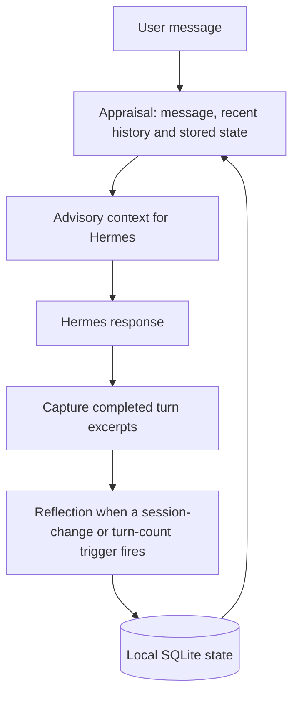

# Anansi for Hermes Agent

Anansi adds a persistent appraisal layer to [Hermes Agent](https://github.com/NousResearch/hermes-agent).
Before an eligible response, it uses a structured LLM call to identify relevant
observations, contradictions and connections to stored goals. After completed
turns, a separate reflection pass updates local state for future conversations.

The current implementation provides advisory context to Hermes. It does not
execute tools, complete goals, run scheduled jobs or send proactive messages.

**Status: experimental; Phase 8 is merged.** The implementation described here is
on `main` at `d46e489`, verified against the repository on September 11, 2026.
Phase 8 repaired priority preservation, persisted support settings, activity
grounding and configuration diagnostics. Its verification records cover 25
behaviors, and the post-merge offline suite passed 199 tests. Live-provider
usefulness and current-host compatibility remain unverified.

The practical aim is continuity: give Hermes access to concerns and goals from
earlier conversations, surface relevant conflicts, and keep an explicitly flagged
priority from disappearing during filtering. Stored context and passing tests
establish parts of that mechanism; they do not establish better user outcomes.

## How it works



1. **Appraise.** Read the current message, recent conversation and Anansi's own
   state. Ask the host LLM for structured signals. Empty messages, short social
   closers and immediate duplicates can skip this step.
2. **Surface.** Filter scored signals by confidence, sanitize their text and render
   an `[anansi appraisal]` block for the host. A successful empty appraisal can
   still surface persisted active flagged priorities when drive is enabled. An
   appraisal failure produces no block.
3. **Capture.** Store short excerpts of completed user and assistant turns.
4. **Reflect.** On a session change or after enough unreflected turns, consolidate
   observations into stored concerns, contradictions, trust scores and an affect
   summary. The default interval is five captured turns.

For example, a conversation that changes from an earlier database preference can
produce a contradiction observation. A stored migration goal can add a related
goal note. Whether the model notices either connection depends on its output;
these are not deterministic fact checks.

## What is implemented

| Capability | Current behavior |
|---|---|
| Per-turn appraisal | A host-mediated JSON call returns instincts, salient observations, contradiction flags, goal relations, advisory memory-search phrases and a short gut reaction. These are model-generated labels and judgments. |
| Persistent context | One SQLite database stores concerns, contradictions, trust scores, affect, goals, turn excerpts and telemetry. |
| Reflection | Small, bounded scalar adjustments update stored state. A processed-turn marker is committed in the same transaction as the changes. |
| Concern decay | Concern weights decay at read time with a seven-day half-life; reflection prunes sufficiently weak entries. Tables also have row limits. |
| Goal storage | Goals have candidate, active, queued or backburner status, success criteria, priority and domain fields, plus persisted support style, push authorization and stall thresholds. Candidate and backburner goals remain inert. |
| Priority preservation | Persisted active flagged priorities survive ordinary-goal storage caps, domain filtering and rendering limits on eligible, successful appraisals with drive enabled. They can surface even if the model supplies no ordinary signals. |
| Drive/accountability display | Goal notes and first-person flagged wants can appear in the appraisal block. Quiet, standard and firm settings change ordinary-note limits or ordering; firmer support depends on stored authorization and threshold eligibility. |
| Activity estimates | File modification times, the repository's HEAD reflog and stored timestamps provide moving/stalled/unknown estimates at read time. Persisted timing overrides conflicting model timing, including a known zero-day age. |
| Controls and diagnostics | Separate appraisal/reflection/drive controls, ordinary-goal domain filtering, a drive attention budget, telemetry and an optional block dump. Configuration-degradation records omit rejected literal values. |

**Goal management is currently a low-level integration surface.** The store exposes
add, update and status operations, but the plugin has no goal-entry UI, command or
conversational approval workflow. An external caller must populate goals. The
schema also has no completed-goal status. Suggested memory searches are phrases
for context; Anansi does not execute them.

## What Phase 8 changed

- **Support settings survive storage and upgrades.** Schema v5 adds per-goal
  support fields through an additive v4 migration. A temporary database lock no
  longer causes that upgrade to treat sound state as corrupt. Legacy-shaped goal
  updates preserve omitted support fields.
- **Priorities survive the full path.** Persisted active flagged goals bypass
  ordinary domain and output limits. The 50-goal storage cap applies to ordinary
  goals, and a successful empty appraisal no longer hides flagged priorities.
- **Pressure has observable controls.** Quiet allows at most one ordinary goal
  note; standard and firm allow at most three. Firm prioritizes eligible,
  user-authorized stalled goals by persisted stalled age. The separate energy
  budget can reduce ordinary output further; flagged priorities are exempt.
- **Goal associations use stronger evidence.** Matching requires whole tokens
  instead of loose substrings, and measured timing takes precedence over model
  timing. Per-goal stall thresholds govern pressure eligibility.
- **Invalid configuration leaves safer diagnostics.** Degradation telemetry
  records the key, rejected input's shape and applied value, rather than the
  rejected literal. Integer coercion also handles infinity and NaN.

The [Phase 8 verification report](.planning/phases/08-close-known-gaps/08-VERIFICATION.md)
maps the twelve requirements to tested behavior. These repairs are integrated
into `main`; the older development branch is no longer the source of current
release status.

## Current limitations

The remaining boundaries matter when evaluating the plugin:

- **Priority protection requires an eligible, successful appraisal.** Disabled
  drive, skipped turns and appraisal failure do not produce flagged-goal context.
  Protected priorities can also make the block exceed its ordinary soft size
  target.
- **Activity is not accomplishment.** Repository activity may be unrelated to a
  goal, directory timestamps do not track every nested edit, and linked Git
  worktrees are not recognized by the current repository detector.
- **Timeouts do not cover the whole hook.** The default eight-second limit bounds
  waiting for an LLM result. Database operations can add delay, and queued calls
  can still execute after their callers time out.
- **Reflection has concurrency and truncation gaps.** Simultaneous triggers can
  duplicate observations. A long transcript can lose earlier material during
  truncation while its rows are still marked processed.
- **Sanitization is heuristic.** Directive text and unmatched goal claims can
  survive rendering. An observational label does not validate the text beneath it.
- **Telemetry is incomplete evidence.** Some failed reflection writes count as
  skips, latency summaries exclude timeouts and database work, and smoke-test
  success does not necessarily prove useful output or full host integration.

Appraisal uses Anansi's own persisted context. It does not currently inspect or
rerank memory injected later in the host's turn. Reflection makes new information
available only after consolidation, so continuity can lag by several turns.

## On the horizon

The planned sequence starts with a richer representation of the user, then adds
ways to revise that representation as evidence changes:

| Planned increment | Intended capability |
|---|---|
| Phase 9: worldview store, next to plan | Represent stable beliefs and their contradiction or supersession relationships as structured data. |
| Phase 9: episode/autobiography layer | Follow worldview work with connections between later observations, recorded events and the user's history. |
| Phase 9: user motivation and habit modeling | Model domain-specific motivation patterns with inspectable, overridable effects on goal salience. The design calls this **user-dopamine**; it is not a biological measurement. |
| Phase 10: reconsolidation and heartbeat | Revisit records that depended on a changed belief, with bounded preparation between sessions for the next user turn. |
| Phase 11: interruption proposals, deferred | Source proposals include opt-in interruption and notification behavior. A separate authority gate must resolve the conflict with the current observational-only constitution before implementation. |
| Phase 12: tuning and audit surfaces | Add inspectable adjustment, cross-session under-response review and deferred-observation surfaces. |
| Phase 13: deferred foundation and parity | Reconcile remaining foundation and compatibility work. |
| Phase 14: security and live verification | Produce security evidence and separately authorized provider-backed checks; this work may run before later features. |

These are **planned capabilities, not current features**, and have no committed
delivery dates. GSD is the active planning workflow. The
[roadmap](.planning/ROADMAP.md) tracks the sequence and gates; the detailed
[backlog](.planning/reference/BACKLOG.md) is retained as engineering reference.
Live-provider evidence remains explicitly **UNRUN**.

## Installation and configuration

Anansi is a standalone Python plugin. It was developed against a Hermes 0.16.0
plugin surface exposing `ctx.llm.complete_structured` and four lifecycle hooks.
Compatibility with current upstream Hermes has not been reverified. The plugin
declares no additional pip dependencies.

From the repository root, with `HERMES_HOME` set to the intended Hermes profile
directory and no existing `plugins/anansi` entry:

```sh
: "${HERMES_HOME:?Set HERMES_HOME to the intended Hermes profile directory}"
mkdir -p "$HERMES_HOME/plugins"
ln -s "$(pwd)/anansi" "$HERMES_HOME/plugins/anansi"
hermes plugins enable anansi
```

The symlink makes subsequent edits in that checkout available to the installed
plugin. Inspect hook activity with a substantive test message:

```sh
HERMES_PLUGINS_DEBUG=1 hermes -z "Review the database migration tradeoffs."
```

Configuration lives under `plugins.entries.anansi` in the host config. A minimal
configuration using defaults available on `main` is:

```yaml
plugins:
  entries:
    anansi:
      enabled: true
      confidence_threshold: 0.6
      deadline_seconds: 8.0
      reflection_enabled: true
      reflect_every_n_turns: 5
      drive_enabled: true
      drive_pressure: standard
      drive_domains: []
      drive_energy_budget: 3
```

On `main`, an absent `llm.model` requests the host's active model. An explicit
override is subject to the host's model-override permission checks; denial triggers
one fallback attempt. `drive_pressure` is wired into rendering and accepts
`quiet`, `standard` or `firm`. `drive_domains: []` leaves ordinary goals
unrestricted; a nonempty list filters ordinary goals while active flagged
priorities remain protected. Per-goal support settings are stored with goals,
not entered through a goal-management UI.

The [plugin reference](anansi/README.md) contains additional configuration and
telemetry details. Its absolute safety claims should be read with the limitations
documented here.

## Data and privacy

State is stored at `$HERMES_HOME/anansi/state.db`. Captured turns can contain up to
2,000 characters each of user and assistant text. Appraisal and reflection send
message/history/state excerpts through the configured host LLM, so local database
storage does not imply local-only processing.

Setting `enabled: false` suppresses appraisal and reflection, but the current
post-turn hook still captures excerpts. It is not a complete data-collection
switch. The plugin's optional `ANANSI_DEBUG_DUMP` also writes rendered blocks to
the supplied path when enabled.

## Development and verification

```sh
./scripts/test.sh
./scripts/test.sh anansi/tests/test_anticreep.py
```

The canonical runner uses the Hermes virtualenv's Python and, when needed, stages
pytest under this repository's `.devtools/` directory without installing it into
the host virtualenv. The suite uses fake LLM responses and temporary databases.

The September 11, 2026 post-merge run at `d46e489` passed **199 tests**. Phase 8
verification covered migration preservation, transient locks, support settings,
priority retention, pressure ordering, fresh activity, diagnostic redaction and
the offline provider boundary. This is offline implementation evidence; it does
not establish live-provider quality, user outcomes or current upstream
compatibility.

Live-provider diagnostic scripts are in [`scripts/`](scripts/). They require a
configured host and provider access, and their output needs inspection because
their exit codes alone are not a complete verification gate.

| Location | Responsibility |
|---|---|
| [`anansi/__init__.py`](anansi/__init__.py) | Hook registration and orchestration |
| [`anansi/appraisal.py`](anansi/appraisal.py) | Appraisal prompt, context, LLM call and parsing |
| [`anansi/reflection.py`](anansi/reflection.py) | Turn capture and consolidation |
| [`anansi/render.py`](anansi/render.py) | Advisory block formatting and sanitization |
| [`anansi/store.py`](anansi/store.py) | SQLite state, activity estimates and telemetry |
| [`anansi/config.py`](anansi/config.py) | Host configuration and defaults |
| [`anansi/tests/`](anansi/tests/) | Offline regression suite |
| [`.planning/`](.planning/) | Design decisions and implementation history |
