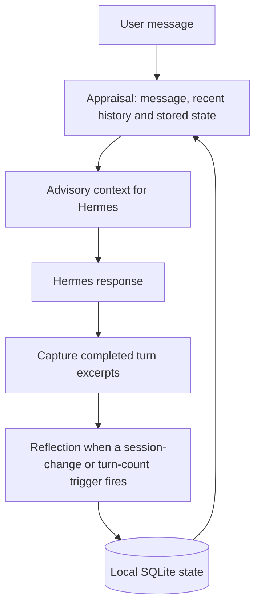

# Anansi for Hermes Agent

Anansi adds a persistent appraisal layer to [Hermes Agent](https://github.com/NousResearch/hermes-agent).
Before an eligible response, it uses a structured LLM call to identify relevant
observations, contradictions and connections to stored goals. After completed
turns, a separate reflection pass updates local state for future conversations.

The current implementation provides advisory context to Hermes. It does not
execute tools, complete goals, run scheduled jobs or send proactive messages.

**Status: experimental.** Appraisal, reflection and goal-related context are
implemented. Important reliability gaps remain, including priority preservation,
activity estimates and timeout handling. The status below describes `main` at
`caed64b`, checked on September 9, 2026; unmerged development work is listed
separately.

## How it works



1. **Appraise.** Read the current message, recent conversation and Anansi's own
   state. Ask the host LLM for structured signals. Empty messages, short social
   closers and immediate duplicates can skip this step.
2. **Surface.** Filter scored signals by confidence, sanitize their text and render
   an `[anansi appraisal]` block for the host. If no signals remain, omit the block.
3. **Capture.** Store short excerpts of completed user and assistant turns.
4. **Reflect.** On a session change or after enough unreflected turns, consolidate
   observations into stored concerns, contradictions, trust scores and an affect
   summary. The default interval is five captured turns.

For example, a conversation that changes from an earlier database preference can
produce a contradiction observation. A stored migration goal can add a related
goal note. Whether the model notices either connection depends on its output;
these are not deterministic fact checks.

## What is implemented

| Capability | Current behavior |
|---|---|
| Per-turn appraisal | A host-mediated JSON call returns instincts, salient observations, contradiction flags, goal relations, advisory memory-search phrases and a short gut reaction. These are model-generated labels and judgments. |
| Persistent context | One SQLite database stores concerns, contradictions, trust scores, affect, goals, turn excerpts and telemetry. |
| Reflection | Small, bounded scalar adjustments update stored state. A processed-turn marker is committed in the same transaction as the changes. |
| Concern decay | Concern weights decay at read time with a seven-day half-life; reflection prunes sufficiently weak entries. Tables also have row limits. |
| Goal storage | Goals have candidate, active, queued or backburner status, success criteria, priority and domain fields. |
| Drive/accountability display | Goal notes and first-person flagged wants can appear in the appraisal block. Flagged goals receive a protected position in the block; activity estimates influence goal-note ordering. |
| Activity estimates | File modification times, the current repository's HEAD reflog and goal timestamps provide moving/stalled/unknown estimates. |
| Controls and diagnostics | Separate appraisal/reflection/drive controls, a domain list, a drive attention budget, telemetry and an optional block dump. |

**Goal management is currently a low-level integration surface.** The store exposes
add, update and status operations, but the plugin has no goal-entry UI, command or
conversational approval workflow. An external caller must populate goals. The
schema also has no completed-goal status. Suggested memory searches are phrases
for context; Anansi does not execute them.

## Current limitations

The design aims to preserve user priorities, keep output observational and let
Hermes continue when appraisal fails. Those aims are not yet reliable guarantees:

- **Flagged priorities can disappear.** Domain filtering and empty-signal
  suppression can hide them; the 50-goal storage cap can evict an older flagged
  goal. Protected rendering alone does not ensure end-to-end preservation.
- **Activity is not accomplishment.** Repository activity may be unrelated to a
  goal, directory timestamps do not track every nested edit, and linked Git
  worktrees are not recognized by the current repository detector. Model-supplied
  stall counts can also override measured values.
- **Timeouts do not cover the whole hook.** The default eight-second limit bounds
  waiting for an LLM result. Database operations can add delay, and queued calls
  can still execute after their callers time out.
- **Reflection has concurrency and truncation gaps.** Simultaneous triggers can
  duplicate observations. A long transcript can lose earlier material during
  truncation while its rows are still marked processed.
- **Sanitization is heuristic.** Directive text and unmatched goal claims can
  survive rendering. An observational label does not validate the text beneath it.
- **Telemetry is incomplete evidence.** Some failed reflection writes count as
  skips, latency summaries exclude timeouts and database work, and smoke-test
  success does not necessarily prove useful output or full host integration.

Appraisal uses Anansi's own persisted context. It does not currently inspect or
rerank memory injected later in the host's turn. Reflection makes new information
available only after consolidation, so continuity can lag by several turns.

## Development work not yet on main

As of September 9, 2026,
[`001-close-known-gaps`](https://github.com/bionicbutterfly13/hermes-anansi-plugin/tree/001-close-known-gaps)
is seven commits ahead of `main`. It contains:

- Schema v5 persistence for per-goal support style and stall-threshold metadata,
  plus an additive v4 upgrade. The stored stall threshold is not yet used in the
  momentum calculation.
- Rendering changes for quiet/standard/firm pressure, a flagged-want display cap
  with a visible overflow count, tighter goal matching and corrected zero-day
  stall wording.
- Config-degradation telemetry and a default request for `gpt-4o-mini`.
- A constitution and explicit backlog specifications.

These changes are implemented on that branch, not shipped on `main`. The review
also found that a locked upgrade can quarantine existing state and create an empty
replacement. The branch should not be treated as closing every reliability gap.

## On the horizon

The planned sequence starts with a richer representation of the user, then adds
ways to revise that representation as evidence changes:

| Planned increment | Intended capability |
|---|---|
| Worldview store | Represent stable beliefs and their contradiction or supersession relationships as structured data. |
| Episode/autobiography layer | Connect later observations to recorded events and the user's history. |
| User motivation and habit modeling | Model domain-specific motivation patterns with inspectable, overridable effects on goal salience. The design calls this **user-dopamine**; it is not a biological measurement. |
| Reconsolidation and heartbeat | Revisit records that depended on a changed belief, with scheduled preparation between sessions for the next user turn. |
| Optional interruption lanes | Explore opt-in, user-defined code-red conditions and proactive notifications, subject to separate controls and host prerequisites. |
| Tuning and audit surfaces | Add a configuration panel, cross-session under-response review and a passive outbox for deferred observations. |

These are **planned capabilities, not current features**, and have no committed
delivery dates. Current-host compatibility, meaningful live-model verification
and substantiated security checks also remain outstanding. The detailed
[backlog](.planning/reference/BACKLOG.md)
is retained in the GSD reference material.

## Installation and configuration

Anansi is a standalone Python plugin. It was developed against a Hermes 0.16.0
plugin surface exposing `ctx.llm.complete_structured` and four lifecycle hooks.
Compatibility with current upstream Hermes has not been reverified. The plugin
declares no additional pip dependencies.

From the repository root, with `HERMES_HOME` set to the intended Hermes profile
directory and no existing `plugins/anansi` entry:

```sh
mkdir -p "$HERMES_HOME/plugins"
ln -s "$(pwd)/anansi" "$HERMES_HOME/plugins/anansi"
hermes plugins enable anansi
```

The symlink makes subsequent edits in that checkout available to the installed
plugin. Inspect hook activity with a substantive test message:

```sh
HERMES_PLUGINS_DEBUG=1 hermes -z "Review the database migration tradeoffs."
```

Configuration lives under `plugins.entries.anansi` in the host config. A minimal
configuration using defaults available on `main` is:

```yaml
plugins:
  entries:
    anansi:
      enabled: true
      confidence_threshold: 0.6
      deadline_seconds: 8.0
      reflection_enabled: true
      reflect_every_n_turns: 5
      drive_enabled: true
      drive_domains: []
      drive_energy_budget: 3
```

On `main`, an absent `llm.model` requests the host's active model. An explicit
override is subject to the host's model-override permission checks; denial triggers
one fallback attempt. `drive_pressure` is parsed on `main`, but wiring it into
rendering is part of the unmerged work above.

The [plugin reference](anansi/README.md) contains additional configuration and
telemetry details. Its absolute safety claims should be read with the limitations
documented here.

## Data and privacy

State is stored at `$HERMES_HOME/anansi/state.db`. Captured turns can contain up to
2,000 characters each of user and assistant text. Appraisal and reflection send
message/history/state excerpts through the configured host LLM, so local database
storage does not imply local-only processing.

Setting `enabled: false` suppresses appraisal and reflection, but the current
post-turn hook still captures excerpts. It is not a complete data-collection
switch. The plugin's optional `ANANSI_DEBUG_DUMP` also writes rendered blocks to
the supplied path when enabled.

## Development and verification

```sh
./scripts/test.sh
./scripts/test.sh anansi/tests/test_anticreep.py
```

The canonical runner uses the Hermes virtualenv's Python and, when needed, stages
pytest under this repository's `.devtools/` directory without installing it into
the host virtualenv. The suite uses fake LLM responses and temporary databases.

The September 8, 2026 review ran this gate on development commit `af2a0bc`:
**183 tests passed**. That result is specific to the development branch; it does
not establish a test count for `main`, live-provider quality or current upstream
compatibility. Additional synthetic probes reproduced reliability failures despite
the passing suite.

Live-provider diagnostic scripts are in [`scripts/`](scripts/). They require a
configured host and provider access, and their output needs inspection because
their exit codes alone are not a complete verification gate.

| Location | Responsibility |
|---|---|
| [`anansi/__init__.py`](anansi/__init__.py) | Hook registration and orchestration |
| [`anansi/appraisal.py`](anansi/appraisal.py) | Appraisal prompt, context, LLM call and parsing |
| [`anansi/reflection.py`](anansi/reflection.py) | Turn capture and consolidation |
| [`anansi/render.py`](anansi/render.py) | Advisory block formatting and sanitization |
| [`anansi/store.py`](anansi/store.py) | SQLite state, activity estimates and telemetry |
| [`anansi/config.py`](anansi/config.py) | Host configuration and defaults |
| [`anansi/tests/`](anansi/tests/) | Offline regression suite |
| [`.planning/`](.planning/) | Design decisions and implementation history |
